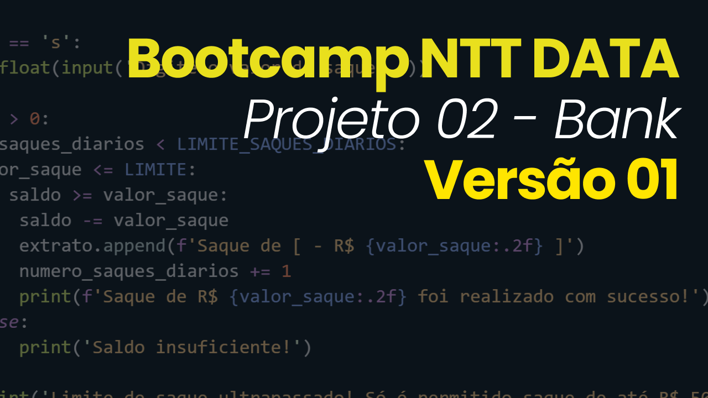

# Sistema Bancário em Python - Versão 01

Este é um projeto simples de um sistema bancário desenvolvido em Python. O sistema permite que o usuário realize operações como depósitos, saques, visualize o extrato bancário e finalize a sessão.

### Codigo

## Funcionalidades

-   **Depósito**: O usuário pode realizar depósitos no saldo bancário. Há uma validação que impede depósitos de valores negativos ou iguais a zero.
-   **Saque**: O sistema permite saques, desde que o saldo seja suficiente e o valor não ultrapasse o limite de R$ 500,00 por saque. Também há um limite de três saques por dia e não é permitido sacar valores negativos ou iguais a zero.
-   **Extrato**: Mostra todas as transações realizadas e o saldo atual.
-   **Sair**: Finaliza a sessão do usuário.

### Regras Implementadas:

1. Não é permitido realizar depósitos ou saques de valores negativos ou iguais a zero.
2. Há um limite de saques diários (3 saques).
3. O limite máximo por saque é de R$ 500,00.

## Exemplo de Uso

Aqui está um exemplo de como o sistema funciona:

-   O usuário deposita R$ 100,00.
-   Em seguida, saca R$ 50,00.
-   O sistema exibe o extrato com as transações realizadas e o saldo atual.

### Veja a simulação do código em funcionamento no vídeo a seguir:

> Clique na imagem acima para assistir à demonstração completa do sistema bancário em ação.
