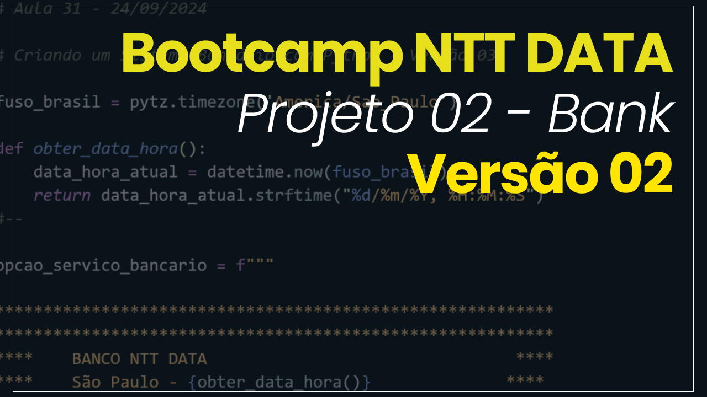
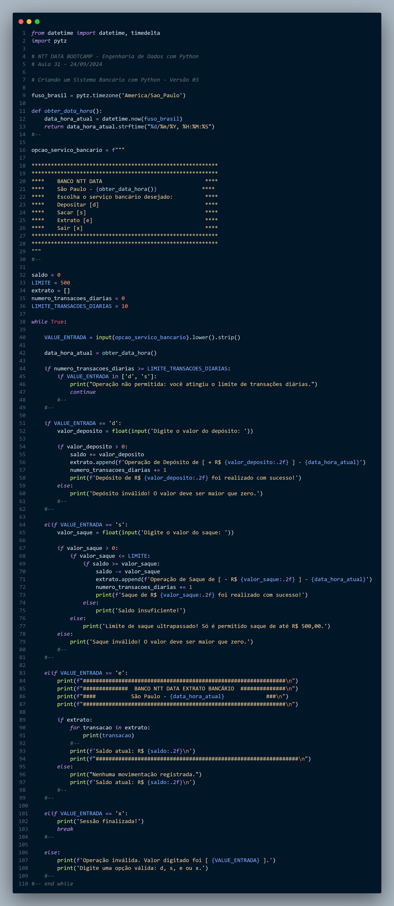
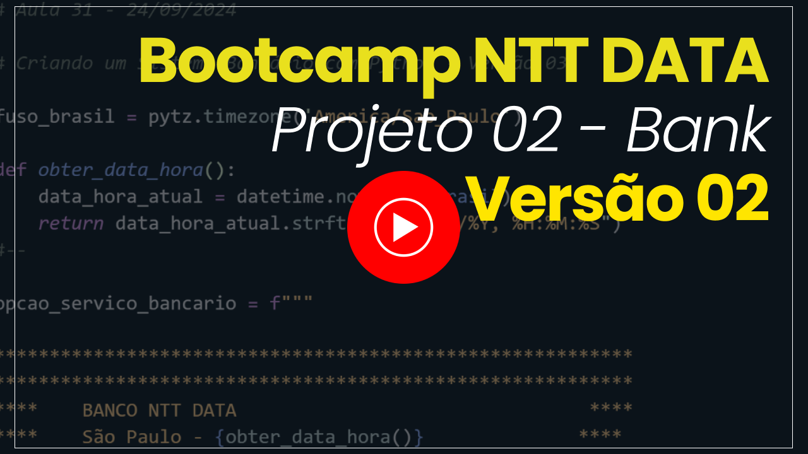

# Sistema Bancário em Python - Versão 02

## Alterações e Melhorias

A segunda versão do sistema bancário trouxe diversas melhorias e novos recursos em relação à primeira versão. Abaixo estão listadas as principais mudanças implementadas:

### 1. Controle de Transações Diárias

Novo Limite de Transações: Agora, o sistema limita o número de transações diárias para 10, independentemente de serem saques ou depósitos. Após atingir esse limite, o usuário ainda poderá consultar o extrato, mas será impedido de realizar novas transações até o próximo dia.
Mensagem de Alerta: Caso o usuário tente realizar uma transação após exceder o limite de 10 operações, ele receberá uma mensagem informando que atingiu o limite de transações diárias.

### 2. Exibição de Data e Hora

Formato Personalizado de Data e Hora: Todas as operações de saque, depósito e consulta de extrato agora exibem a data e a hora da transação utilizando o fuso horário brasileiro (America/Sao_Paulo), garantindo precisão e consistência no histórico bancário.
Função Personalizada para Data e Hora: Foi criada a função obter_data_hora() para centralizar e simplificar a manipulação e formatação de datas, utilizando a biblioteca pytz.

### 3. Extrato Detalhado

Registro Completo de Movimentações: Cada movimentação (saque ou depósito) é registrada no extrato com a data, hora e o valor da transação.
Consultas Ilimitadas ao Extrato: Mesmo após atingir o limite de transações diárias, o usuário ainda pode consultar o extrato bancário sem restrições.

### Código

### Veja a simulação do código em funcionamento no vídeo a seguir:

> Clique na imagem acima para assistir à demonstração completa do sistema bancário em ação.

# 💻 Me adicione nas redes sociais:

